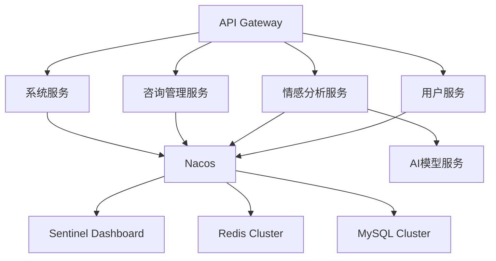

# 智愈星桥

基于多模态情感智能分析的心理健康管理APP

<!-- PROJECT SHIELDS -->

[](https://spring.io/)
[](https://github.com/alibaba/spring-cloud-alibaba)
[](https://www.mysql.com/)


<!-- PROJECT LOGO -->
<br />
<a href="https://github.com/Nanoic39/mindlift/tree/main">
    
  </a>

<p align="center">
  <h3 align="center">智愈星桥</h3>
  
  <p align="center">
    基于多模态情感智能分析的心理健康管理APP
    <br />
    <a href="https://github.com/shaojintian/Best_README_template"><strong>探索本项目的文档 »</strong></a>
    <br />
    <br />
    <a href="https://github.com/Nanoic39/mindlift">查看Demo</a>
    ·
    <a href="https://github.com/Nanoic39/mindlift/issues">报告Bug</a>
    ·
    <a href="https://github.com/Nanoic39/mindlift/issues">提出新特性</a>
  </p>

</p>

# 🌟 项目简介
"智愈星桥"是基于多模态情感智能分析的心理健康管理平台，后端系统采用**分布式微服务架构**，通过整合文本、语音、图像等多维度数据分析用户情绪状态，提供个性化心理健康服务。系统日均支持10万+并发请求，响应时间≤200ms。

# 🛠️ 技术栈
| 组件              | 用途                    | 版本       |
|-------------------|-------------------------|------------|
| SpringCloudAlibaba| 微服务框架              | 2021.0.4.0 |
| Nacos             | 服务注册与配置中心      | 2.1.0      |
| Sentinel          | 流量控制与熔断降级      | 1.8.5      |
| Redis             | 分布式缓存              | 6.2.6      |
| MySQL             | 关系型数据库            | 8.0.28     |
| MyBatis-Plus      | ORM框架                 | 3.5.1      |
| OpenFeign         | 服务间通信              | 3.1.4      |

# 🏗️ 系统架构

## 文件目录说明
```
智愈星桥-后端/
├── docs/                           # 文档目录
│   ├── arch.md                    # 系统架构文档
│   └── api/                       # Swagger/OpenAPI文档
├── scripts/                       # 部署脚本
│   ├── nacos-start.sh             # Nacos启动脚本
│   └── sentinel-dashboard.sh      # Sentinel控制台脚本
├── sql/                           # 数据库脚本
│   └── scbridge-init.sql          # 初始化SQL文件
├── sc-parent/                     # 父工程聚合模块
│   ├── pom.xml                    # 父POM依赖管理
├── sc-common/                     # 公共模块
│   ├── src/
│   │   ├── main/
│   │   │   ├── java/com/sc/common/
│   │   │   │   ├── config/       # 公共配置（Redis/Sentinel等）
│   │   │   │   ├── utils/        # 工具类库
│   │   │   │   └── entity/       # 公共实体类
│   │   │   └── resources/
│   │   │       └── META-INF/     # SPI扩展配置
├── sc-gateway/                    # API网关模块
│   ├── src/
│   │   ├── main/
│   │   │   ├── java/com/sc/gateway/
│   │   │   │   └── GatewayApplication.java
│   │   │   └── resources/
│   │   │       ├── application.yml
│   │   │       └── bootstrap.yml # Nacos配置引导
├── user-service/                  # 用户服务
│   ├── src/
│   │   ├── main/
│   │   │   ├── java/com/sc/user/
│   │   │   │   ├── controller/   # 用户相关API
│   │   │   │   ├── service/      # 业务逻辑层
│   │   │   │   └── UserApplication.java
│   │   │   └── resources/
│   │   │       ├── mapper/       # MyBatis映射文件
│   │   │       └── sentinel/     # 限流规则
├── emotion-service/               # 情感分析服务
│   ├── src/
│   │   ├── main/
│   │   │   ├── java/com/sc/emotion/
│   │   │   │   ├── ml/           # 机器学习模型接口
│   │   │   │   └── processor/    # 多模态数据处理
├── consult-service/               # 咨询管理服务
│   ├── src/
│   │   ├── main/
│   │   │   ├── java/com/sc/consult/
│   │   │   │   ├── scheduler/    # 咨询调度器
│   │   │   │   └── rtc/          # 实时通信处理
├── system-service/                # 系统服务
│   ├── src/
│   │   ├── main/
│   │   │   ├── java/com/sc/system/
│   │   │   │   ├── monitor/      # 系统监控端点
│   │   │   │   └── filter/       # 敏感词过滤器
├── docker/                        # Docker部署配置
│   ├── mysql/
│   │   └── my.cnf                # MySQL自定义配置
│   └── redis/
│       └── redis-cluster.conf    # Redis集群配置
└── .gitignore                    # Git排除配置
```


# 🚀 环境部署

```bash | 开发环境
JDK 17-22 | MySQL 8.0 | Redis 6.2 | Nacos 2.1.0 | Sentinel 1.8.5
```
## 启动步骤

``` bash | 服务发现配置
# 启动Nacos服务
sh nacos/bin/startup.sh -m standalone
```

``` sql | 数据库初始化
CREATE DATABASE scbridge DEFAULT CHARSET utf8mb4;
# 导入scbridge-init.sql
```

``` bash | 服务启动（示例）
# 网关服务
cd sc-gateway && mvn spring-boot:run

# 用户服务 
cd user-service && mvn spring-boot:run -Dspring.profiles.active=dev
```

# ⚙️ 配置中心

``` yaml | Nacos配置示例（common-dev.yaml）：
spring:
  datasource:
    url: jdbc:mysql://${MYSQL_HOST:127.0.0.1}:3306/scbridge
  redis:
    cluster:
      nodes: 192.168.0.100:6379,192.168.0.101:6379

sentinel:
  transport:
    dashboard: localhost:8080
```

# 📌 注意事项

多环境配置需通过spring.profiles.active指定

服务启动顺序：Nacos → Sentinel → 基础服务 → 网关

Redis集群配置需确保所有节点防火墙开放

# 🤝 贡献指南
Fork本项目


创建特性分支 (git checkout -b feature/AmazingFeature)

提交更改 (git commit -m 'Add some AmazingFeature')

推送到分支 (git push origin feature/AmazingFeature)

发起Pull Request

# 版权说明

该项目签署了MIT 授权许可，详情请参阅 [LICENSE.txt](https://github.com/shaojintian/Best_README_template/blob/master/LICENSE.txt)

# Design By MindLift-智愈星桥 开发团队


